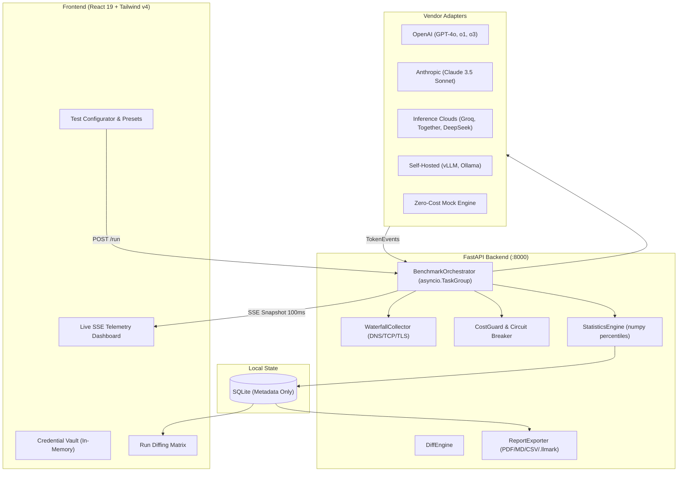

# ⚡ LLMark — The Postman for LLM Endpoints

[](https://opensource.org/licenses/MIT)
[](https://www.python.org/)
[](https://fastapi.tiangolo.com/)
[](https://react.dev/)
[](https://tailwindcss.com/)
[](https://github.com/)

> **Benchmark any LLM vendor in under 60 seconds.**  
> Measure microsecond tail latency (TTFT P95/P99, ITL P95/P99, Max Freeze), Goodput (SLO Yield %), and true cost per successful request — with ephemeral zero-cloud privacy.

---

## 📑 Table of Contents

- [The Thesis: Why LLMark Exists](#-the-thesis-why-llmark-exists)
- [Key Features](#-key-features)
- [Architecture & Request Flow](#-architecture--request-flow)
- [Quickstart (Single Command)](#-quickstart-single-command)
- [Mathematical Measurement Rigor](#-mathematical-measurement-rigor)
- [Workload Presets](#-workload-presets)
- [Head-to-Head Diffing & Export Hub](#-head-to-head-diffing--export-hub)
- [Headless CI/CD Mode (`llmark` CLI)](#-headless-cicd-mode-llmark-cli)
- [API Reference](#-api-reference)
- [Provider Setup Guide](#-provider-setup-guide)
- [Testing & Quality Assurance](#-testing--quality-assurance)
- [Project Documentation Deep Dives](#-project-documentation-deep-dives)

---

## 🎯 The Thesis: Why LLMark Exists

In 2026, competitive advantage in AI engineering is determined by **how fast, reliable, and cost-effective model endpoints run under production traffic.**

- **The Problem:** Vendor marketing claims are empty-queue best-case numbers. Generic load tools (k6, Locust) cannot parse Server-Sent Events (SSE) or calculate token economics. LLMPerf was archived in December 2025.
- **The Solution:** LLMark is the **"Postman for LLM Endpoints"** — an open-source, local-first benchmarking platform that streams microsecond tail analytics, enforces financial circuit breakers, and generates executive reports in 60 seconds.

---

## ✨ Key Features

- ⏱️ **Microsecond Stream Capture:** Measures **Time to First Token (TTFT)**, **Inter-Token Latency (ITL)**, and **Decode TPS** without smoothing out tail spikes.
- 🧠 **Reasoning Model Isolation:** Measures **Time to First Answer (TTFA)** to decouple internal thinking tokens (`<think>` / `reasoning_content`) in DeepSeek-R1 and OpenAI o-series.
- 🌊 **Network Waterfall Profiler:** Socket-level timing isolates client **DNS lookup**, **TCP connection**, and **TLS handshake** from server prefill time.
- 🎯 **Goodput (SLO Yield %):** Measures the strict percentage of requests that meet **all** user latency criteria ($\text{TTFT} \le X \land \text{TPOT} \le Y \land \text{E2E} \le Z \land 200\text{ OK}$).
- 🛡️ **Financial Guardrails:** Pre-flight token calculation & real-time **Hard Spend Cap circuit breakers** to stop runaway billing.
- ⚖️ **Run Diffing Matrix:** Head-to-head comparison of Run A vs Run B with automated improvement/regression percentage change indicators.
- 📑 **Multi-Format Export Hub:** 1-click **ReportLab PDF**, **Markdown tables**, **CSV spreadsheets**, and single-file **`.llmark` bundles** (JSON/gzip).
- 🔒 **Local-First & Ephemeral Memory:** Zero telemetry. API keys are kept strictly in memory during execution and never written to disk or database.
- 💻 **Headless CI Runner:** Exit code-driven CLI (`0` = PASS, `1` = SLO FAIL, `2` = ERROR) for automated regression testing in GitHub Actions.

---

## 🏗️ Architecture & Request Flow



---

## 🚀 Quickstart (Single Command)

### Option 1: Docker (Single Command)
```bash
docker compose up --build
```
Open **[http://localhost:8000](http://localhost:8000)** in your browser.

---

### Option 2: Local One-Command Concurrent Runner

From the repository root (`llmark/`), use any of the unified launchers:

```bash
# Using Python
python run.py

# Using PowerShell (Windows)
.\run.ps1

# Using Make
make dev

# Using NPM
npm run dev
```

- **Frontend:** [http://localhost:5173](http://localhost:5173)
- **Backend API:** [http://127.0.0.1:8000](http://127.0.0.1:8000)
- **Interactive Swagger Docs:** [http://127.0.0.1:8000/api/docs](http://127.0.0.1:8000/api/docs)

---

## 🧮 Mathematical Measurement Rigor

```
Request Sent (t0)
   │
   ├─ [DNS + TCP + TLS Handshake] ──── (Network Connection Phase)
   │
   ├─ [Server Queue & Prefill] ────── (Inference Engine Prefill Phase)
   │
First Chunk (t_first) ─────────────── TTFT = t_first - t0
   │                                  TTFA = t_first_answer - t0 (Reasoning isolation)
   ├─ Token Gap (t2 - t1) ─────────── Chunk Gap 1 (ICL / ITL)
   ├─ Token Gap (t3 - t2) ─────────── Chunk Gap 2 (ICL / ITL)
   │
Stream Closed (t_last) ────────────── TTLT / E2E = t_last - t0
                                      TPOT = (t_last - t_first) / output_tokens
```

### 1. Time to First Token (TTFT)
$$\text{TTFT} = t_{\text{first\_chunk}} - t_{\text{request\_sent}}$$

### 2. Time to First Answer (TTFA) — Reasoning Isolation
$$\text{TTFA} = t_{\text{first\_answer\_chunk}} - t_{\text{request\_sent}}$$
$$\text{Reasoning Overhead} = \text{TTFA} - \text{TTFT}$$

### 3. Inter-Token Latency (ITL) vs Inter-Chunk Latency (ICL)
$$\text{ITL}_n = \frac{t_{n+1} - t_n}{\text{token\_count}(\text{chunk}_{n+1})}$$
*All delta intervals across all requests are aggregated into a single unaggregated population array to compute true P50, P75, P95, P99, and Max ITL.*

### 4. Goodput (SLO Yield %)
$$\text{Goodput} = \frac{\sum_{i=1}^{N} \mathbb{I}(\text{TTFT}_i \le \text{SLO}_{\text{TTFT}} \land \text{TPOT}_i \le \text{SLO}_{\text{TPOT}} \land \text{E2E}_i \le \text{SLO}_{\text{E2E}} \land \text{Status}_i = 200)}{N} \times 100\%$$

---

## 📦 Production Workload Presets

LLMark includes 16 production-grade workload presets meticulously calibrated to evaluate distinct hardware, network, and algorithmic performance dimensions:

| Workload Preset | Prompt Tokens | Output Tokens | Purpose & Target Stress Dimension |
|---|---|---|---|
| **Rate Limit & Quota Probing** (`rate_limit_probe`) | ~5 | 1–2 | Micro-token calls probing RPM/TPM ceilings, HTTP 429 backoff handling & gateway queues |
| **Prefill Scaling & TTFT** (`prefill_ttft`) | ~4,000 | 1–2 | Isolates pure KV prefill computation speed, prompt processing throughput (tok/s) & tail TTFT (P95/P99) |
| **Streaming Decode & Jitter** (`decode_throughput`) | ~40 | ~800 | Sustained autoregressive decode speed (tok/s), Inter-Token Latency (ITL) jitter & TPOT stability |
| **Reasoning & CoT Deep-Dive** (`reasoning_cot`) | ~300 | ~800 | Multi-constraint fleet scheduling & optimization DAG triggering deep Chain-of-Thought thinking (TTFA & token multiplier) |
| **Agentic Tool & Function Calling** (`agentic_tool_calling`) | ~1,200 | ~150 | Multi-tool JSON schemas evaluating function invocation latency, schema correctness & parameter precision under incident triage |
| **Code Generation & Syntax Stream** (`code_generation`) | ~1,500 | ~800 | Code generation throughput, syntax tree indentation jitter, strict typing & token emission smoothness |
| **Enterprise RAG Synthesis** (`rag_synthesis`) | ~3,500 | ~400 | Ingests 5 enterprise technical documents, evaluating multi-source cross-referencing, conflict resolution & grounded citation synthesis |
| **Long-Context & Needle Retrieval** (`long_context_retrieval`) | ~16,000 | ~300 | Massive 16k context window with 3 cryptographic/operational needles at 15%, 50%, and 85% depth measuring attention scaling & memory pressure |
| **Document Summarization & Distill** (`summarization_distill`) | ~4,500 | ~300 | Dense Annual Infrastructure & FinOps audit report evaluating information distillation speed into executive briefs |
| **Structured JSON & Grammar** (`structured_json`) | ~600 | ~300 | Guided grammar decoding evaluating parser compliance, syntax validity & constrained decode latency penalty |
| **Interactive Conversational** (`chat_interactive`) | ~200 | ~150 | Conversational responsiveness, end-user perceived latency (TTFT P50/P95) & human reading speed cadence |
| **Few-Shot In-Context Classification** (`fewshot_classification`) | ~1,200 | ~10 | 12 production incident exemplars evaluating in-context classification latency & ultra-low decode routing |
| **Multimodal Vision & OCR** (`multimodal_vision`) | ~1,800 | ~200 | 4K system topology diagram and telemetry heatmap evaluating vision encoder projection latency & OCR layout extraction |
| **Multi-Turn Session Context** (`multiturn_agentic`) | ~2,500 | ~350 | Deep 5-turn collaborative DevOps incident response history evaluating KV cache memory expansion & turn latency drift |
| **Prompt Prefix Cache Warm / Hit** (`kv_cache_reuse`) | ~3,200 | ~150 | Deterministic static architecture specification measuring KV cache hit speedup ratio, TTFT reduction & caching discount throughput |
| **Custom Workload Studio** (`custom`) | User Defined | User Defined | Full flexibility with custom prompt payload, token bounds & multi-dimensional telemetry matrix |

---

## ⚖️ Head-to-Head Diffing & Export Hub

### Visual Diffing Matrix
Select any two benchmark runs in the **Diff Runs** tab to see immediate comparison deltas:
- **Green Badges:** Performance improvements (e.g. $-45.2\%$ TTFT P95, $+120.5\%$ TPS).
- **Red Badges:** Performance regressions.

### Export Hub
- **Executive PDF:** Multi-page branded PDF with summary cards, percentiles table, and waterfall baseline.
- **Markdown Summary:** Copy-ready Markdown table for PR descriptions and issue tracking.
- **CSV Data:** Per-metric RFC 4180 spreadsheet.
- **`.llmark` Bundle:** Portable compressed JSON archive for cross-team sharing without central databases.

---

## 💻 Headless CI/CD Mode (`llmark` CLI)

Integrate automated model performance gates into your CI/CD pipelines:

```bash
# Run benchmark from configuration file
python backend/cli.py run --config benchmark_ci.yaml --fail-under-goodput 95.0 --output-md report.md

# Exit codes:
# 0 -> Benchmark passed all SLO Goodput criteria
# 1 -> SLO Goodput failed (performance regression detected)
# 2 -> Execution error
```

### GitHub Actions CI Example (`.github/workflows/benchmark.yml`)
```yaml
name: LLM Performance Canary Gate
on: [pull_request, push]

jobs:
  benchmark:
    runs-on: ubuntu-latest
    steps:
      - uses: actions/checkout@v4
      - uses: astral-sh/setup-uv@v5
      - run: uv pip install -e ./backend
      - name: Run LLMark Canary Benchmark
        run: |
          python backend/cli.py run \
            --config benchmark_ci.yaml \
            --fail-under-goodput 95.0 \
            --output-md canary_report.md
      - name: Publish Benchmark Summary to PR
        if: always()
        run: cat canary_report.md >> $GITHUB_STEP_SUMMARY
```

---

## 📡 API Reference

| Endpoint | Method | Description |
|---|---|---|
| `/api/benchmark/run` | `POST` | Start a new concurrent benchmark run (returns `benchmark_id`). |
| `/api/benchmark/stream` | `GET` | SSE stream emitting microsecond progress snapshots and waterfall data. |
| `/api/benchmark/{id}/abort` | `POST` | Instantly abort an in-flight benchmark run. |
| `/api/benchmark/cost-estimate` | `GET` | Pre-flight token calculation & estimated dollar spend. |
| `/api/diff` | `GET` | Compare Run A vs Run B and compute metric percentage deltas. |
| `/api/export/pdf/{id}` | `GET` | Download executive ReportLab PDF report. |
| `/api/export/markdown/{id}` | `GET` | Retrieve raw Markdown summary table. |
| `/api/export/csv/{id}` | `GET` | Download RFC 4180 CSV telemetry spreadsheet. |
| `/api/export/bundle/{id}` | `GET` | Download portable `.llmark` compressed JSON archive. |
| `/api/history` | `GET` | Paginated list of historical benchmark runs. |
| `/health` | `GET` | Health check endpoint. |

---

## 🔌 Provider Setup Guide

### 1. OpenAI
```json
{
  "vendor": "openai",
  "model": "gpt-4o",
  "credential": { "api_key": "sk-..." }
}
```

### 2. Anthropic
```json
{
  "vendor": "anthropic",
  "model": "claude-3-5-sonnet-20241022",
  "credential": { "api_key": "sk-ant-..." }
}
```

### 3. Self-Hosted vLLM / Ollama
```json
{
  "vendor": "openai_compatible",
  "model": "meta-llama/llama-3.3-70b-instruct",
  "credential": {
    "api_key": "EMPTY",
    "base_url": "http://localhost:8000/v1"
  }
}
```

### 4. Groq / Together AI / DeepSeek
```json
{
  "vendor": "openai_compatible",
  "model": "deepseek-ai/deepseek-r1",
  "credential": {
    "api_key": "gsk_...",
    "base_url": "https://api.groq.com/openai/v1"
  }
}
```

---

## 🧪 Testing & Quality Assurance

Run the complete automated test suite (34 test cases covering Statistics, Adapters, Tokenizer, Waterfall, CostGuard, DiffEngine, Exporters, and CLI):

```bash
# Run backend pytest suite
cd backend
.venv\Scripts\pytest -v

# Run frontend build & typecheck
cd frontend
npm run build
```

---

## 📚 Project Documentation Deep Dives

For in-depth architectural and technical blueprints:
- [base_idea.md](base_idea.md) — Initial Architectural Blueprint & Value Proposition
- [reasoning.md](reasoning.md) — Comprehensive Mathematical Reasoning & System Design
- [tech_spec.md](tech_spec.md) — Technical Specification & Pydantic Data Contracts

---

## 📜 License
MIT License. Built for the global AI engineering community.
