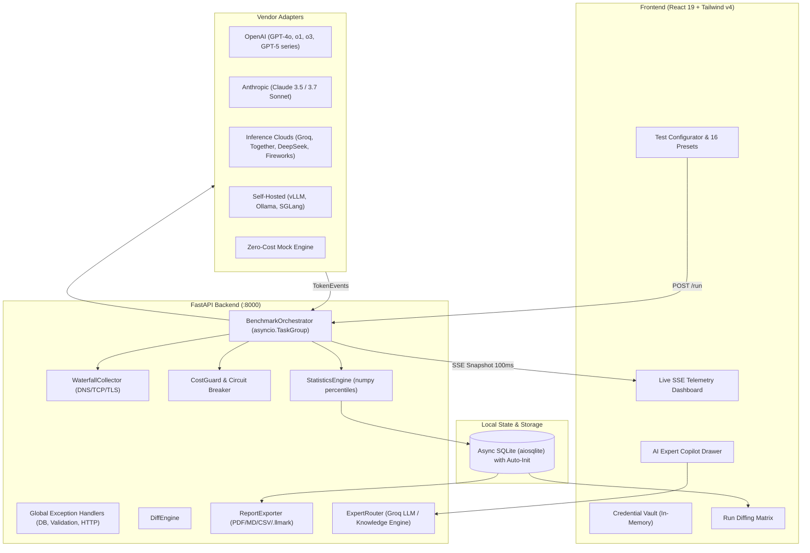

# LLMark — The Postman for LLM Endpoints

[](https://opensource.org/licenses/MIT)
[](https://www.python.org/)
[](https://fastapi.tiangolo.com/)
[](https://react.dev/)
[](https://tailwindcss.com/)
[](https://github.com/)

> **Benchmark any LLM endpoint in under 60 seconds.**  
> Measure microsecond tail latency (TTFT P95/P99, ITL P95/P99, Max Freeze), Goodput (SLO Yield %), Time to First Answer (TTFA) for reasoning models, and true cost per successful request — with ephemeral zero-cloud privacy and self-healing local storage.

---

## Table of Contents

- [Overview](#overview)
- [Key Features](#key-features)
- [Architecture & Request Flow](#architecture--request-flow)
- [Quickstart](#quickstart)
  - [Option 1: Docker (Single Command or Multi-Container)](#option-1-docker-single-command-or-multi-container)
  - [Option 2: Local One-Command Concurrent Runner](#option-2-local-one-command-concurrent-runner)
  - [Option 3: Deploy Separate Frontend & Backend (Netlify + Render)](#option-3-deploy-separate-frontend--backend-netlify--render)
  - [Option 4: Deploy as Single Container on Render](#option-4-deploy-as-single-container-on-render)
- [Measurement Methodology](#measurement-methodology)
  - [1. Time to First Token (TTFT)](#1-time-to-first-token-ttft)
  - [2. Time to First Answer (TTFA) — Reasoning Isolation](#2-time-to-first-answer-ttfa--reasoning-isolation)
  - [3. Inter-Token Latency (ITL) vs Inter-Chunk Latency (ICL)](#3-inter-token-latency-itl-vs-inter-chunk-latency-icl)
  - [4. Goodput (SLO Yield %)](#4-goodput-slo-yield-)
- [Production Workload Presets](#production-workload-presets)
- [Reliability & Database Architecture](#reliability--database-architecture)
- [AI Inference Copilot & Knowledge Engine](#ai-inference-copilot--knowledge-engine)
- [Head-to-Head Diffing & Export Hub](#head-to-head-diffing--export-hub)
- [Headless CI/CD Mode (llmark CLI)](#headless-cicd-mode-llmark-cli)
- [API Reference](#api-reference)
- [Provider Setup Guide](#provider-setup-guide)
- [Testing & Quality Assurance](#testing--quality-assurance)
- [Project Documentation](#project-documentation)
- [License](#license)

---

## Overview

In production AI systems, competitive advantage is determined by how fast, reliable, and cost-effective model endpoints run under real-world traffic.

- **The Problem:** Vendor marketing claims reflect empty-queue, best-case numbers. Generic load testing tools (such as k6 or Locust) cannot parse Server-Sent Events (SSE) streams or calculate token economics. Legacy tools such as LLMPerf are unmaintained.
- **The Solution:** LLMark is an open-source, local-first benchmarking platform for LLM endpoints. It streams microsecond-level tail analytics, isolates reasoning token overhead, enforces financial circuit breakers, and generates executive reports in under 60 seconds.

---

## Key Features

- **Microsecond Stream Capture:** Measures Time to First Token (TTFT), Inter-Token Latency (ITL), and Decode TPS without smoothing out tail latency spikes.
- **Reasoning Model Isolation:** Measures Time to First Answer (TTFA) to decouple internal thinking tokens (`<think>` / `reasoning_content`) in DeepSeek-R1, OpenAI o-series, and Claude reasoning modes.
- **Network Waterfall Profiler:** Socket-level timing isolates client DNS lookup, TCP connection, and TLS handshake latency from server prefill time.
- **Goodput (SLO Yield %):** Measures the strict percentage of requests that meet all latency criteria simultaneously ($\text{TTFT} \le X \land \text{TPOT} \le Y \land \text{E2E} \le Z \land 200\text{ OK}$).
- **Cost Guard & Circuit Breakers:** Pre-flight token calculation and real-time Hard Spend Cap circuit breakers terminate runs immediately if dollar spend limits are reached.
- **Inference Copilot & Knowledge Base:** Built-in AI assistant powered by Groq LLM (with model auto-discovery) or an offline knowledge base of 37+ expert architectural Q&A articles.
- **Self-Healing Storage:** Idempotent, thread-safe asynchronous SQLite persistence that automatically verifies and initializes table schemas on demand.
- **Structured Error Handling:** Centralized FastAPI exception handlers intercepting database, validation, and transport exceptions with structured JSON diagnostics.
- **Run Diffing Matrix:** Head-to-head comparison of Run A vs Run B with automated regression and improvement delta indicators.
- **Multi-Format Export Hub:** One-click exports for ReportLab PDF reports, Markdown tables, CSV spreadsheets, and portable `.llmark` JSON/gzip bundles.
- **Local-First & Ephemeral Memory:** Zero external telemetry. API credentials remain strictly in memory during execution and are never written to disk or database.
- **Headless CI Runner:** Exit code-driven CLI (`0` = PASS, `1` = SLO FAIL, `2` = ERROR) for automated regression testing in continuous integration workflows.

---

## Architecture & Request Flow



---

## Quickstart

### Option 1: Docker (Single Command or Multi-Container)

```bash
# Multi-container setup (Backend on :8000 + Nginx Frontend on :3000)
docker compose up --build

# Or build & run standalone containers individually:
# Backend:
docker build -t llmark-backend -f backend/Dockerfile backend/
docker run -p 8000:8000 llmark-backend

# Frontend:
docker build -t llmark-frontend -f frontend/Dockerfile frontend/
docker run -p 3000:80 llmark-frontend
```

- **Frontend UI:** [http://localhost:3000](http://localhost:3000) (or [http://localhost:8000](http://localhost:8000) in monolith mode)
- **Backend API:** [http://localhost:8000](http://localhost:8000)

See [DOCKER.md](./DOCKER.md) for the complete Docker reference, including container configurations, environment variables, architecture diagrams, and deployment instructions.

---

### Option 2: Local One-Command Concurrent Runner

From the repository root (`llmark/`), use any of the unified launchers:

```bash
# Using Python
python run.py

# Using PowerShell (Windows)
.\run.ps1

# Using Make
make dev

# Using NPM
npm run dev
```

- **Frontend UI:** [http://localhost:5173](http://localhost:5173)
- **Backend API:** [http://127.0.0.1:8000](http://127.0.0.1:8000)
- **Swagger Documentation:** [http://127.0.0.1:8000/api/docs](http://127.0.0.1:8000/api/docs)
- **Health Check:** [http://127.0.0.1:8000/health](http://127.0.0.1:8000/health)

---

### Option 3: Deploy Separate Frontend & Backend (Netlify + Render)

This architecture provides fast UI loads from Netlify CDN, with the Python inference engine running on Render.

#### Part 1: Deploy Backend on Render (Python API)
1. Push or fork this repository to your GitHub or GitLab account.
2. Navigate to [dashboard.render.com](https://dashboard.render.com) > **New +** > **Blueprint** (or **Web Service**).
3. Connect your repository. Render will read [`render.yaml`](./render.yaml).
4. Note your public backend URL: `https://your-llmark-backend.onrender.com`.

#### Part 2: Deploy Frontend on Netlify (React 19)
1. Navigate to [app.netlify.com](https://app.netlify.com) > **Add new site** > **Import an existing project**.
2. Select your `llmark` repository.
3. Configure build settings (pre-configured via [`netlify.toml`](./netlify.toml)):
   - **Base directory**: `frontend`
   - **Build command**: `npm run build`
   - **Publish directory**: `dist`
4. Under **Environment variables**, add:
   - `VITE_API_URL`: `https://your-llmark-backend.onrender.com`
5. Click **Deploy Site**. Netlify will deploy your UI globally.

---

### Option 4: Deploy as Single Container on Render

LLMark includes a [`render.yaml`](./render.yaml) Blueprint and multi-stage `Dockerfile` to serve both frontend and backend from a single container:

[](https://render.com/deploy)

1. Deploy the blueprint on [Render](https://dashboard.render.com).
2. *(Optional Keep-Alive)* Configure a monitor (e.g. via [UptimeRobot](https://uptimerobot.com)) to ping `https://<your-app>.onrender.com/health` every 10 minutes to maintain active container state.

---

## Measurement Methodology

```
Request Sent (t0)
   │
   ├─ [DNS + TCP + TLS Handshake] ──── (Network Connection Phase)
   │
   ├─ [Server Queue & Prefill] ────── (Inference Engine Prefill Phase)
   │
First Chunk (t_first) ─────────────── TTFT = t_first - t0
   │                                  TTFA = t_first_answer - t0 (Reasoning isolation)
   ├─ Token Gap (t2 - t1) ─────────── Chunk Gap 1 (ICL / ITL)
   ├─ Token Gap (t3 - t2) ─────────── Chunk Gap 2 (ICL / ITL)
   │
Stream Closed (t_last) ────────────── TTLT / E2E = t_last - t0
                                      TPOT = (t_last - t_first) / output_tokens
```

### 1. Time to First Token (TTFT)
$$\text{TTFT} = t_{\text{first\_chunk}} - t_{\text{request\_sent}}$$

### 2. Time to First Answer (TTFA) — Reasoning Isolation
$$\text{TTFA} = t_{\text{first\_answer\_chunk}} - t_{\text{request\_sent}}$$
$$\text{Reasoning Overhead} = \text{TTFA} - \text{TTFT}$$

### 3. Inter-Token Latency (ITL) vs Inter-Chunk Latency (ICL)
$$\text{ITL}_n = \frac{t_{n+1} - t_n}{\text{token\_count}(\text{chunk}_{n+1})}$$

All delta intervals across all requests are aggregated into a single unaggregated population array to compute true P50, P75, P95, P99, and Max ITL.

### 4. Goodput (SLO Yield %)
$$\text{Goodput} = \frac{\sum_{i=1}^{N} \mathbb{I}(\text{TTFT}_i \le \text{SLO}_{\text{TTFT}} \land \text{TPOT}_i \le \text{SLO}_{\text{TPOT}} \land \text{E2E}_i \le \text{SLO}_{\text{E2E}} \land \text{Status}_i = 200)}{N} \times 100\%$$

---

## Production Workload Presets

LLMark includes 16 production-grade workload presets calibrated for distinct hardware, network, and token dimensions:

| Workload Preset | Prompt Tokens | Output Tokens | Purpose & Target Stress Dimension |
|---|---|---|---|
| **Rate Limit & Quota Probing** (`rate_limit_probe`) | ~5 | 1–2 | Micro-token calls probing RPM/TPM ceilings, HTTP 429 backoff handling, and gateway queues |
| **Prefill Scaling & TTFT** (`prefill_ttft`) | ~4,000 | 1–2 | Isolates pure KV prefill computation speed, prompt processing throughput (tok/s), and tail TTFT (P95/P99) |
| **Streaming Decode & Jitter** (`decode_throughput`) | ~40 | ~800 | Sustained autoregressive decode speed (tok/s), Inter-Token Latency (ITL) jitter, and TPOT stability |
| **Reasoning & CoT Deep-Dive** (`reasoning_cot`) | ~300 | ~800 | Multi-constraint fleet scheduling and optimization DAG triggering deep Chain-of-Thought thinking (TTFA and token multiplier) |
| **Agentic Tool & Function Calling** (`agentic_tool_calling`) | ~1,200 | ~150 | Multi-tool JSON schemas evaluating function invocation latency, schema correctness, and parameter precision under incident triage |
| **Code Generation & Syntax Stream** (`code_generation`) | ~1,500 | ~800 | Code generation throughput, syntax tree indentation jitter, strict typing, and token emission smoothness |
| **Enterprise RAG Synthesis** (`rag_synthesis`) | ~3,500 | ~400 | Ingests 5 enterprise technical documents, evaluating multi-source cross-referencing, conflict resolution, and grounded citation synthesis |
| **Long-Context & Needle Retrieval** (`long_context_retrieval`) | ~16,000 | ~300 | 16k context window with 3 cryptographic/operational needles at 15%, 50%, and 85% depth measuring attention scaling and memory pressure |
| **Document Summarization & Distill** (`summarization_distill`) | ~4,500 | ~300 | Dense Annual Infrastructure & FinOps audit report evaluating information distillation speed into executive briefs |
| **Structured JSON & Grammar** (`structured_json`) | ~600 | ~300 | Guided grammar decoding evaluating parser compliance, syntax validity, and constrained decode latency penalty |
| **Interactive Conversational** (`chat_interactive`) | ~200 | ~150 | Conversational responsiveness, end-user perceived latency (TTFT P50/P95), and human reading speed cadence |
| **Few-Shot In-Context Classification** (`fewshot_classification`) | ~1,200 | ~10 | 12 production incident exemplars evaluating in-context classification latency and low-decode routing |
| **Multimodal Vision & OCR** (`multimodal_vision`) | ~1,800 | ~200 | 4K system topology diagram and telemetry heatmap evaluating vision encoder projection latency and OCR layout extraction |
| **Multi-Turn Session Context** (`multiturn_agentic`) | ~2,500 | ~350 | Deep 5-turn collaborative DevOps incident response history evaluating KV cache memory expansion and turn latency drift |
| **Prompt Prefix Cache Warm / Hit** (`kv_cache_reuse`) | ~3,200 | ~150 | Deterministic static architecture specification measuring KV cache hit speedup ratio, TTFT reduction, and caching discount throughput |
| **Custom Workload Studio** (`custom`) | User Defined | User Defined | Custom prompt payload, token bounds, and multi-dimensional telemetry matrix |

---

## Reliability & Database Architecture

LLMark implements a resilience architecture designed for continuous operation:

1. **Self-Healing Storage (`ensure_db_initialized`)**:
   - The async SQLite session generator and background worker tasks execute an idempotent schema check on first connection.
   - If tables are uninitialized (e.g. cold starts, container restarts, or CLI executions outside lifespan), schemas are constructed automatically with zero runtime errors.
2. **Global Exception Handlers**:
   - `SQLAlchemyError`: Logs structured diagnostics and emits standardized `500 Internal Server Error` JSON (`{"detail": "...", "error_type": "DatabaseError"}`).
   - `RequestValidationError`: Formats payload validation issues into structured `422 Unprocessable Entity` responses.
   - `StarletteHTTPException`: Standardizes status codes and user-facing messages.
   - `Exception`: Catch-all protection ensuring unexpected server errors return structured responses without exposing raw stack traces.
3. **Route-Level Guardrails**:
   - `/api/history`, `/api/diff`, `/api/export`, and `/api/benchmark` handlers wrap queries and file generators with granular logging and structured HTTP exceptions.

---

## AI Inference Copilot & Knowledge Engine

LLMark includes an integrated **Inference Copilot** (`/api/expert`):
- **Live Groq LLM Assistant**: Answers custom questions regarding queuing theory, GPU VRAM sizing formulas, Continuous Batching, and TTFT optimization.
- **Offline Knowledge Engine**: Over 37 curated architectural articles accessible instantly without requiring an API key.

---

## Head-to-Head Diffing & Export Hub

### Visual Diffing Matrix
Select any two benchmark runs in the **Diff Runs** tab to inspect comparative deltas:
- **Improvement Badges:** Indicates performance gains (e.g. $-45.2\%$ TTFT P95, $+120.5\%$ TPS).
- **Regression Badges:** Highlights latency degradation or throughput drop.

### Export Hub
- **Executive PDF:** Multi-page branded PDF report with summary cards, percentiles table, and waterfall baseline.
- **Markdown Summary:** Formatted Markdown table suitable for PR descriptions and issue tracking.
- **CSV Data:** Per-metric RFC 4180 spreadsheet.
- **`.llmark` Bundle:** Portable compressed JSON archive for cross-team sharing without centralized databases.

---

## Headless CI/CD Mode (llmark CLI)

Integrate automated model performance validation into continuous integration pipelines:

```bash
# Run benchmark from configuration file
python backend/app/cli.py run --config benchmark_ci.yaml --fail-under-goodput 95.0 --output-md report.md

# Exit codes:
# 0 -> Benchmark passed all SLO Goodput criteria
# 1 -> SLO Goodput failed (performance regression detected)
# 2 -> Execution error
```

### GitHub Actions CI Example (`.github/workflows/benchmark.yml`)

```yaml
name: LLM Performance Canary Gate
on: [pull_request, push]

jobs:
  benchmark:
    runs-on: ubuntu-latest
    steps:
      - uses: actions/checkout@v4
      - uses: actions/setup-python@v5
        with:
          python-version: '3.12'
      - name: Install dependencies
        run: |
          cd backend
          pip install -e ".[dev]"
      - name: Run LLMark Canary Benchmark
        run: |
          python backend/app/cli.py run \
            --vendor mock \
            --model gpt-4o \
            --preset chat \
            --concurrency 5 \
            --duration 15 \
            --fail-under-goodput 90.0 \
            --output-md canary_report.md
      - name: Publish Benchmark Summary to PR
        if: always()
        run: cat canary_report.md >> $GITHUB_STEP_SUMMARY
```

---

## API Reference

| Endpoint | Method | Description |
|---|---|---|
| `/api/benchmark/run` | `POST` | Start a new concurrent benchmark run (returns `benchmark_id`). |
| `/api/benchmark/stream` | `GET` | SSE stream emitting microsecond progress snapshots and waterfall data. |
| `/api/benchmark/{id}/abort` | `POST` | Instantly abort an in-flight benchmark run. |
| `/api/benchmark/cost-estimate` | `GET` | Pre-flight token calculation and estimated dollar spend. |
| `/api/benchmark/models` | `POST` | Fetch listed models from remote vendor endpoint. |
| `/api/benchmark/presets` | `GET` | Retrieve 16 production workload presets with prompt metadata. |
| `/api/diff` | `GET` | Compare Run A vs Run B and compute metric percentage deltas. |
| `/api/export/pdf/{id}` | `GET` | Download executive ReportLab PDF report. |
| `/api/export/markdown/{id}` | `GET` | Retrieve raw Markdown summary table. |
| `/api/export/csv/{id}` | `GET` | Download RFC 4180 CSV telemetry spreadsheet. |
| `/api/export/bundle/{id}` | `GET` | Download portable `.llmark` compressed JSON archive. |
| `/api/history` | `GET` | Paginated list of historical benchmark runs. |
| `/api/history/{run_id}` | `GET` | Full telemetry and percentiles for a specific historical benchmark run. |
| `/api/expert/ask` | `POST` | Query queuing theory and benchmark optimization assistant. |
| `/api/expert/status` | `GET` | Check AI Expert Copilot status and available models. |
| `/health` | `GET` | Health check probe endpoint. |

---

## Provider Setup Guide

### 1. OpenAI & Flagship Models
```json
{
  "vendor": "openai",
  "model": "gpt-4o",
  "credential": { "api_key": "sk-..." }
}
```

### 2. Anthropic
```json
{
  "vendor": "anthropic",
  "model": "claude-3-7-sonnet",
  "credential": { "api_key": "sk-ant-..." }
}
```

### 3. Self-Hosted vLLM / Ollama / SGLang
```json
{
  "vendor": "openai_compatible",
  "model": "meta-llama/llama-3.3-70b-instruct",
  "credential": {
    "api_key": "EMPTY",
    "base_url": "http://localhost:8000/v1"
  }
}
```

### 4. Groq / Together AI / DeepSeek / Fireworks
```json
{
  "vendor": "openai_compatible",
  "model": "deepseek-ai/deepseek-r1",
  "credential": {
    "api_key": "gsk_...",
    "base_url": "https://api.groq.com/openai/v1"
  }
}
```

---

## Testing & Quality Assurance

Execute the test suite and static analysis checks:

```bash
# Run backend pytest suite
cd backend
pytest -v

# Run linting and formatting checks
python -m ruff check .
python -m ruff format --check .

# Run static type checking
python -m mypy app

# Run frontend build and typecheck
cd ../frontend
npm run build
```

---

## Project Documentation

For architectural blueprints and module-level details:
- [backend/README.md](backend/README.md) — Backend architecture, module layout, and database lifecycle.
- [frontend/README.md](frontend/README.md) — Frontend architecture, React 19 UI component structure, and SSE state management.
- [DOCKER.md](DOCKER.md) — Comprehensive Docker deployment and multi-stage container guide.
- [base_idea.md](base_idea.md) — Initial Architectural Blueprint & Value Proposition.

---

## License

This project is licensed under the MIT License. See [LICENSE](LICENSE) for details.

