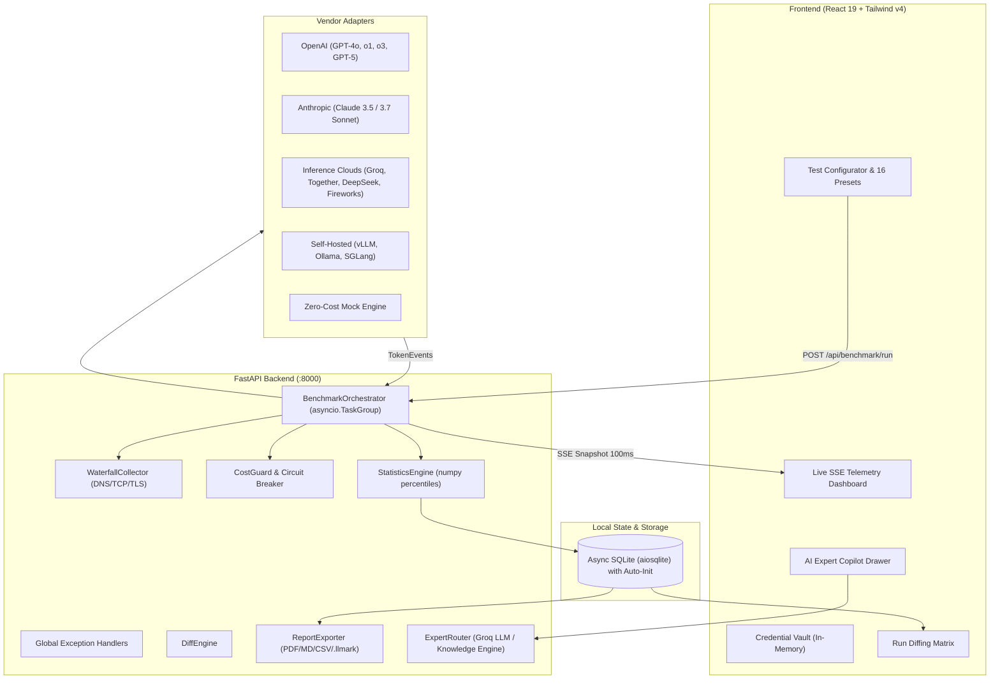

# LLMark — The Postman for LLM Endpoints

[](LICENSE)
[](https://www.python.org/)
[](https://fastapi.tiangolo.com/)
[](https://react.dev/)
[](https://tailwindcss.com/)
[](https://github.com/cosmos-127/llmark/actions/workflows/ci.yml)
[](backend/tests/)

> **Benchmark any LLM endpoint in under 60 seconds.**  
> Measure microsecond tail latency (TTFT P95/P99, ITL P95/P99, Max Freeze), Goodput (SLO Yield %), Time to First Answer (TTFA) for reasoning models, and true cost per successful request — with ephemeral zero-cloud privacy and self-healing local storage.

💡 **Zero-Config Developer Testing:** No API keys or paid credits required to start hacking! LLMark ships with an internal, high-fidelity `mock` adapter that simulates realistic token streaming, jitter, and reasoning traces instantly.

---

## Table of Contents

- [⚡ 30-Second Quickstart](#-30-second-quickstart)
- [🛠️ Developer Command Center](#️-developer-command-center)
- [📂 Repository & Architecture Tour](#-repository--architecture-tour)
- [🧩 Developer Guide: Extending LLMark](#-developer-guide-extending-llmark)
  - [1. Adding a New LLM Provider Adapter](#1-adding-a-new-llm-provider-adapter)
  - [2. Adding a Custom Workload Preset](#2-adding-a-custom-workload-preset)
  - [3. Triggering Benchmarks via REST API (cURL)](#3-triggering-benchmarks-via-rest-api-curl)
- [🤖 Headless CI/CD Mode (llmark CLI)](#-headless-cicd-mode-llmark-cli)
- [⚙️ Configuration & Environment Variables](#️-configuration--environment-variables)
- [📐 Measurement Methodology](#-measurement-methodology)
- [📦 Production Workload Presets](#-production-workload-presets)
- [🚢 Deployment Options](#-deployment-options)
- [🧪 Testing & Quality Assurance](#-testing--quality-assurance)
- [🤝 Contributing & License](#-contributing--license)

---

## ⚡ 30-Second Quickstart

### Prerequisites
- **Python 3.12+**
- **Node.js 18+** & **npm 9+**
- *(Optional)* **Docker & Docker Compose**

### 1. Clone & Setup Environment
```bash
git clone https://github.com/cosmos-127/llmark.git
cd llmark
cp .env.example .env
```

### 2. Install Dependencies
Choose your preferred toolchain:
```bash
# Using Make (Linux / macOS)
make install

# Using PowerShell (Windows)
.\make.ps1 install

# Or manually:
pip install -e "./backend[dev]"
cd frontend && npm install && cd ..
```

### 3. Start Development Servers
Launch both FastAPI backend and Vite frontend with unified logging and hot-reload:
```bash
python run.py
# Or: make dev | .\run.ps1 | npm run dev
```

| Service | URL | Description |
|---|---|---|
| **Frontend UI** | [http://localhost:5173](http://localhost:5173) | Interactive React 19 telemetry dashboard |
| **Backend API** | [http://127.0.0.1:8000](http://127.0.0.1:8000) | Async streaming FastAPI benchmark engine |
| **Interactive Docs** | [http://127.0.0.1:8000/api/docs](http://127.0.0.1:8000/api/docs) | Swagger / OpenAPI specification & testing UI |
| **Health Check** | [http://127.0.0.1:8000/health](http://127.0.0.1:8000/health) | Container liveness probe |

> 🚀 **First Test Run:** Navigate to `http://localhost:5173`, leave vendor as `Mock Engine`, and click **Start Benchmark**. You'll see real-time microsecond SSE streaming charts, waterfall connection latencies, and Goodput calculations immediately.

---

### Docker Quickstart (Alternative)

Run the complete multi-container stack (Backend on `:8000` + Nginx Frontend on `:3000`):

```bash
docker compose up --build
```

For advanced container setups, standalone builds, and multi-stage configurations, see [DOCKER.md](DOCKER.md).

---

## 🛠️ Developer Command Center

LLMark includes cross-platform automation scripts (`Makefile`, `make.ps1`, `make.cmd`, and `package.json`):

| Action | Make (Linux/macOS) | Windows PowerShell | NPM Script | Direct Command |
|---|---|---|---|---|
| **Run Full Stack** | `make dev` | `.\run.ps1` | `npm run dev` | `python run.py` |
| **Run Backend Only** | `make backend` | `.\make.ps1 backend` | `npm run backend` | `cd backend && uvicorn app.main:app --reload --port 8000` |
| **Run Frontend Only** | `make frontend` | `.\make.ps1 frontend` | `npm run frontend` | `cd frontend && npm run dev` |
| **Run All Tests** | `make test` | `.\make.ps1 test` | `npm test` | `pytest backend/tests/unit && cd frontend && npm run build` |
| **Lint & Format Check** | `make lint` | `.\make.ps1 lint` | — | `cd backend && ruff check . && ruff format --check .` |
| **Typecheck** | `make typecheck` | `.\make.ps1 typecheck` | — | `cd backend && mypy app` |
| **Build Frontend** | `make build` | `.\make.ps1 build` | `npm run build` | `cd frontend && npm run build` |
| **Clean Temp Files** | `make clean` | `.\make.ps1 clean` | — | `rm -rf backend/.pytest_cache llmark.db` |

---

## 📂 Repository & Architecture Tour

```
llmark/
├── backend/
│   ├── app/
│   │   ├── adapters/          # LLM vendor adapters (OpenAI, Anthropic, Mock, etc.)
│   │   │   ├── base.py        # Abstract VendorAdapter base class & TokenEvent
│   │   │   ├── registry.py    # Adapter resolver & factory
│   │   │   └── ...            # Vendor implementations (openai, anthropic, mock)
│   │   ├── api/
│   │   │   ├── deps.py        # Dependency injection (async db sessions)
│   │   │   └── routes/        # FastAPI REST & SSE endpoints (/benchmark, /diff, /expert, /export, /history)
│   │   ├── core/
│   │   │   ├── orchestrator.py# BenchmarkOrchestrator (asyncio.TaskGroup & CancellationToken)
│   │   │   ├── statistics_engine.py # Unaggregated numpy percentiles & 4-gate Goodput
│   │   │   ├── cost_guard.py  # Hard spend cap & pre-flight token cost calculator
│   │   │   ├── waterfall_collector.py # Socket-level DNS, TCP, and TLS latency profiler
│   │   │   ├── prompt_presets.py      # 16 production workload prompt templates
│   │   │   └── report_exporter.py     # PDF, Markdown, CSV, and .llmark serializers
│   │   ├── db/                # Async SQLite engine with self-healing schema initialization
│   │   ├── models/            # Pydantic schemas and SQLAlchemy ORM models
│   │   ├── cli.py             # Headless CI runner with assertion engine
│   │   └── main.py            # FastAPI entrypoint, middleware & global exception handlers
│   └── tests/                 # Unit & integration tests (pytest)
│
├── frontend/
│   ├── src/
│   │   ├── components/
│   │   │   ├── test-configurator/  # Workload selector, traffic curve sliders, waterfall
│   │   │   ├── live-dashboard/     # Real-time charts, metric cards, token terminal
│   │   │   ├── credential-vault/   # In-memory ephemeral API key manager
│   │   │   ├── common/             # AI Expert Copilot drawer, Markdown/KaTeX renderer
│   │   │   └── ui/                 # Radix UI primitives & theme toggles
│   │   ├── hooks/useBenchmarkSSE.ts# High-frequency SSE stream consumer & buffer
│   │   └── pages/                  # BenchmarkPage, DiffPage, HistoryPage
│   └── package.json           # React 19, Tailwind CSS v4, Vite 6
│
├── run.py                     # Unified concurrent runner for backend + frontend
├── Makefile / make.ps1        # Build automation for Linux/macOS and Windows
├── docker-compose.yml         # Multi-container orchestration
└── benchmark_ci.yaml          # Example headless CI benchmark configuration
```

### Request Flow & Telemetry Pipeline



---

## 🧩 Developer Guide: Extending LLMark

### 1. Adding a New LLM Provider Adapter

All model providers implement the clean `VendorAdapter` interface in [`backend/app/adapters/base.py`](backend/app/adapters/base.py).

To add a new provider (e.g., Mistral, Cohere, or an internal AI gateway):

**Step 1:** Create `backend/app/adapters/custom_adapter.py`:
```python
import time
from typing import AsyncGenerator
from app.adapters.base import VendorAdapter, TokenEvent
from app.models.schemas import BenchmarkRequest

class CustomAdapter(VendorAdapter):
    async def stream_completion(
        self, request: BenchmarkRequest, cancellation_token
    ) -> AsyncGenerator[TokenEvent, None]:
        # 1. Connect to provider client/endpoint
        # 2. Iterate through streamed chunks
        for chunk_text in ["Hello", " world!"]:
            if cancellation_token.is_cancelled:
                break
            yield TokenEvent(
                token=chunk_text,
                timestamp_ns=time.perf_counter_ns(),
                is_reasoning=False,
            )
```

**Step 2:** Register your adapter in [`backend/app/adapters/registry.py`](backend/app/adapters/registry.py):
```python
from app.adapters.custom_adapter import CustomAdapter

ADAPTER_REGISTRY["my_vendor"] = CustomAdapter
```

**Step 3:** Add unit tests in [`backend/tests/unit/test_adapters.py`](backend/tests/unit/test_adapters.py).

---

### 2. Adding a Custom Workload Preset

Workload presets define standard prompt structures, target token counts, and stress vectors.

1. Open [`backend/app/core/prompt_presets.py`](backend/app/core/prompt_presets.py).
2. Add your preset enum and definition:
```python
class PromptPreset(str, Enum):
    # ... existing presets ...
    MY_CUSTOM_PRESET = "my_custom_preset"

PRESET_CONFIGS[PromptPreset.MY_CUSTOM_PRESET] = PresetConfig(
    name="My Custom Stress Test",
    description="Evaluates high-concurrency micro-payload latency under memory pressure.",
    prompt_template="Analyze this payload: {data}",
    expected_prompt_tokens=500,
    expected_output_tokens=150,
)
```

---

### 3. Triggering Benchmarks via REST API (cURL)

You can run benchmarks programmatically via the REST API:

```bash
# Start a benchmark run
curl -X POST http://127.0.0.1:8000/api/benchmark/run \
  -H "Content-Type: application/json" \
  -d '{
    "vendor": "mock",
    "model": "gpt-4o",
    "preset": "chat_interactive",
    "concurrency": 5,
    "duration_seconds": 10,
    "hard_spend_cap": 1.0
  }'

# Stream live progress snapshots via SSE
curl -N http://127.0.0.1:8000/api/benchmark/stream

# Fetch executive markdown report once completed
curl http://127.0.0.1:8000/api/export/markdown/<run_id>
```

---

## 🤖 Headless CI/CD Mode (llmark CLI)

Incorporate LLM latency and reliability gates into pull requests to prevent performance regressions:

```bash
# Run benchmark from configuration file
python backend/app/cli.py run --config benchmark_ci.yaml --fail-under-goodput 95.0 --output-md report.md

# Run with custom quality assertions
python backend/app/cli.py run \
  --vendor mock \
  --model gpt-4o \
  --preset chat_interactive \
  --concurrency 5 \
  --duration 10 \
  -a "p95_ttft < 600" \
  -a "goodput >= 90.0"

# Exit codes:
# 0 -> All SLO thresholds and quality assertions passed
# 1 -> Goodput fell below threshold or assertion violated (Performance Regression)
# 2 -> Execution error
```

### GitHub Actions Integration Example

LLMark includes a ready-to-use CI workflow in [`.github/workflows/ci.yml`](.github/workflows/ci.yml) that executes automated tests and canary benchmarks on every push and PR.

---

## ⚙️ Configuration & Environment Variables

Copy `.env.example` to `.env`. All environment variables are optional:

| Variable | Default | Description |
|---|---|---|
| `GROQ_API_KEY` | *(None)* | Powers the AI Inference Copilot drawer (free at [Groq Console](https://console.groq.com/keys)). If omitted, LLMark uses its built-in offline 37+ article knowledge base. |
| `GROQ_MODEL` | `llama-3.3-70b-versatile` | Model ID for AI Copilot queries. |
| `DATABASE_URL` | `sqlite+aiosqlite:///./llmark.db` | SQLite async database connection string. |
| `HOST` | `0.0.0.0` | Backend API bind address. |
| `PORT` | `8000` | Backend API port. |
| `BACKEND_CORS_ORIGINS` | `*` | Allowed CORS origins for frontend requests. |
| `VITE_API_URL` | *(Proxied)* | Used in frontend production builds to point to backend API. |

> 🔒 **Ephemeral Credential Vault:** Model vendor keys (OpenAI, Anthropic, Groq, etc.) can also be entered directly into the UI. Credentials remain strictly in memory during execution and are **never written to disk or the database**.

---

## 📐 Measurement Methodology

```
Request Sent (t0)
   │
   ├─ [DNS + TCP + TLS Handshake] ──── (Network Connection Phase)
   │
   ├─ [Server Queue & Prefill] ────── (Inference Engine Prefill Phase)
   │
First Chunk (t_first) ─────────────── TTFT = t_first - t0
   │                                  TTFA = t_first_answer - t0 (Reasoning isolation)
   ├─ Token Gap (t2 - t1) ─────────── Chunk Gap 1 (ICL / ITL)
   ├─ Token Gap (t3 - t2) ─────────── Chunk Gap 2 (ICL / ITL)
   │
Stream Closed (t_last) ────────────── TTLT / E2E = t_last - t0
                                      TPOT = (t_last - t_first) / output_tokens
```

<details>
<summary><strong>Click to view mathematical metric formulas</strong></summary>

### 1. Time to First Token (TTFT)
$$\text{TTFT} = t_{\text{first\_chunk}} - t_{\text{request\_sent}}$$

### 2. Time to First Answer (TTFA) — Reasoning Isolation
$$\text{TTFA} = t_{\text{first\_answer\_chunk}} - t_{\text{request\_sent}}$$
$$\text{Reasoning Overhead} = \text{TTFA} - \text{TTFT}$$

### 3. Inter-Token Latency (ITL) vs Inter-Chunk Latency (ICL)
$$\text{ITL}_n = \frac{t_{n+1} - t_n}{\text{token\_count}(\text{chunk}_{n+1})}$$
All delta intervals across all requests are aggregated into a single unaggregated population array to compute true P50, P75, P95, P99, and Max ITL.

### 4. Goodput (SLO Yield %)
$$\text{Goodput} = \frac{\sum_{i=1}^{N} \mathbb{I}(\text{TTFT}_i \le \text{SLO}_{\text{TTFT}} \land \text{TPOT}_i \le \text{SLO}_{\text{TPOT}} \land \text{E2E}_i \le \text{SLO}_{\text{E2E}} \land \text{Status}_i = 200)}{N} \times 100\%$$

</details>

---

## 📦 Production Workload Presets

<details>
<summary><strong>Click to view all 16 production workload presets</strong></summary>

| Workload Preset | Prompt Tokens | Output Tokens | Purpose & Target Stress Dimension |
|---|---|---|---|
| **Rate Limit & Quota Probing** (`rate_limit_probe`) | ~5 | 1–2 | Micro-token calls probing RPM/TPM ceilings, HTTP 429 backoff handling, and gateway queues |
| **Prefill Scaling & TTFT** (`prefill_ttft`) | ~4,000 | 1–2 | Isolates pure KV prefill computation speed, prompt processing throughput (tok/s), and tail TTFT (P95/P99) |
| **Streaming Decode & Jitter** (`decode_throughput`) | ~40 | ~800 | Sustained autoregressive decode speed (tok/s), Inter-Token Latency (ITL) jitter, and TPOT stability |
| **Reasoning & CoT Deep-Dive** (`reasoning_cot`) | ~300 | ~800 | Multi-constraint fleet scheduling and optimization DAG triggering deep Chain-of-Thought thinking |
| **Agentic Tool & Function Calling** (`agentic_tool_calling`) | ~1,200 | ~150 | Multi-tool JSON schemas evaluating function invocation latency and schema parameter precision |
| **Code Generation & Syntax Stream** (`code_generation`) | ~1,500 | ~800 | Code generation throughput, syntax tree indentation jitter, and token emission smoothness |
| **Enterprise RAG Synthesis** (`rag_synthesis`) | ~3,500 | ~400 | Ingests 5 enterprise technical documents, evaluating multi-source synthesis and grounded citations |
| **Long-Context & Needle Retrieval** (`long_context_retrieval`) | ~16,000 | ~300 | 16k context window with 3 needles measuring attention scaling and memory pressure |
| **Document Summarization & Distill** (`summarization_distill`) | ~4,500 | ~300 | Dense Annual Infrastructure & FinOps audit report evaluating distillation speed |
| **Structured JSON & Grammar** (`structured_json`) | ~600 | ~300 | Guided grammar decoding evaluating parser compliance and constrained decode latency penalty |
| **Interactive Conversational** (`chat_interactive`) | ~200 | ~150 | Perceived latency (TTFT P50/P95) and human reading speed cadence |
| **Few-Shot In-Context Classification** (`fewshot_classification`) | ~1,200 | ~10 | 12 production incident exemplars evaluating in-context classification latency |
| **Multimodal Vision & OCR** (`multimodal_vision`) | ~1,800 | ~200 | 4K system topology diagram evaluating vision encoder projection latency and OCR extraction |
| **Multi-Turn Session Context** (`multiturn_agentic`) | ~2,500 | ~350 | Deep 5-turn collaborative DevOps incident response history evaluating KV cache expansion |
| **Prompt Prefix Cache Warm / Hit** (`kv_cache_reuse`) | ~3,200 | ~150 | Static architecture specification measuring KV cache hit speedup ratio and TTFT reduction |
| **Custom Workload Studio** (`custom`) | Custom | Custom | User-defined prompt payload, token bounds, and multi-dimensional telemetry matrix |

</details>

---

## 🚢 Deployment Options

LLMark can be deployed as standalone containers, multi-container setups, or across cloud providers:

- **Docker Compose:** `docker compose up --build` (See [DOCKER.md](DOCKER.md))
- **Render & Netlify:** Host backend on Render and frontend on Netlify CDN (See [DEPLOYMENT.md](DEPLOYMENT.md))
- **Single Container on Render:** Multi-stage container using [`render.yaml`](render.yaml)

---

## 🧪 Testing & Quality Assurance

Run the test suite and static analysis:

```bash
# Run backend pytest suite (unit tests)
pytest backend/tests/unit -v

# Run linting and code formatting checks
cd backend
python -m ruff check .
python -m ruff format --check .

# Run static type checking
python -m mypy app

# Run frontend build & typecheck
cd ../frontend
npm run build
```

---

## 🤝 Contributing & License

Contributions are welcome! Please review [CONTRIBUTING.md](CONTRIBUTING.md) before submitting pull requests.

This project is licensed under the **MIT License**. See [LICENSE](LICENSE) for details.
