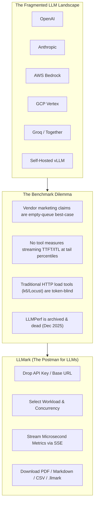
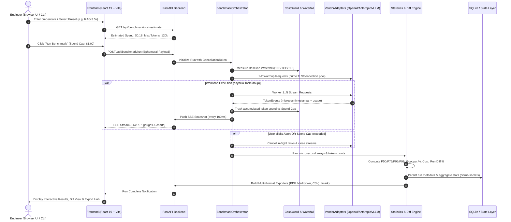
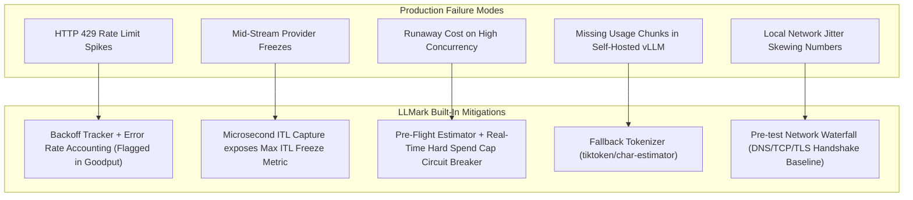

# 🧠 LLMark — Comprehensive Start-to-End Architectural Reasoning

---

## 1. The Core Thesis: Why LLMark Must Exist

### The 2026 AI Infrastructure Reality
In 2026, the competitive advantage in building AI products has shifted from *which model has 1% higher MMLU* to **how fast, reliable, and cost-effective model endpoints run under real production traffic.**

Teams no longer deploy a single model from a single provider. A modern AI engineering stack routinely splits workloads across:
- **Cloud Frontiers:** OpenAI (GPT-4o, o3-mini), Anthropic (Claude 3.5 Sonnet), Google (Gemini 1.5/2.0), AWS Bedrock.
- **Specialized Inference Clouds:** Groq (LPU), Together AI, Fireworks AI, DeepSeek.
- **Self-Hosted / Private Clusters:** vLLM, Ollama, TGI running on internal GPU nodes (H100, L40S, A100).



### Why Existing Tools Fail
1. **Generic HTTP Load Tools (k6, Locust, Gatling, wrk):**
   - Measure HTTP status codes, request-response wall time, and total bytes.
   - **Blind to LLM semantics:** They cannot parse Server-Sent Events (SSE), do not understand `delta.content`, cannot compute Time to First Token (TTFT) or Inter-Token Latency (ITL), and cannot compute cost based on token counts.
2. **Archived / Specialized Tools (LLMPerf, GenAI-Perf):**
   - *LLMPerf* was archived in December 2025. It lacked a UI, lacked ephemeral security, and averaged ITL per-request before aggregating (erasing stream pauses).
   - *GenAI-Perf* is NVIDIA/Triton specific with no multi-vendor cloud API support and no browser UI.

---

## 2. Mathematical & Measurement Foundations

To provide honest, reproducible numbers, LLMark establishes a rigorous mathematical model for LLM streaming metrics.

```
Request Sent (t0)
   │
   ├─ [DNS + TCP + TLS Handshake] ──── (Network Connection Phase)
   │
   ├─ [Server Queue & Prefill] ────── (Inference Engine Prefill Phase)
   │
First Chunk (t_first) ─────────────── TTFT = t_first - t0
   │                                  TTFA = t_first_answer - t0 (Reasoning isolation)
   ├─ Token Gap (t2 - t1) ─────────── Chunk Gap 1 (ICL / ITL)
   ├─ Token Gap (t3 - t2) ─────────── Chunk Gap 2 (ICL / ITL)
   ├─ Token Gap (tn - tn-1) ───────── Chunk Gap n (ICL / ITL)
   │
Stream Closed (t_last) ────────────── TTLT / E2E = t_last - t0
                                      TPOT = (t_last - t_first) / output_tokens
```

### Metric Definitions & Computational Rigor

#### 1. Time to First Token (TTFT)
$$\text{TTFT} = t_{\text{first\_chunk}} - t_{\text{request\_sent}}$$
Measures the sum of:
- Client network transmission time.
- Vendor queueing delay (concurrency saturation).
- KV cache loading & prefill compute time over input tokens.

#### 2. Time to First Answer (TTFA) — *Reasoning Model Isolation*
Reasoning models (e.g. DeepSeek-R1, OpenAI o1/o3) output "thinking" tokens (`<think>` or `delta.reasoning_content`) before generating the actual user-facing answer.
$$\text{TTFA} = t_{\text{first\_answer\_chunk}} - t_{\text{request\_sent}}$$
$$\text{Reasoning Overhead} = \text{TTFA} - \text{TTFT}$$

#### 3. Inter-Token Latency (ITL) vs Inter-Chunk Latency (ICL)
When streaming over HTTP SSE, providers often batch multiple tokens into a single chunk (`chunk_tokens > 1`):
$$\text{ICL}_n = t_{n+1} - t_n$$
$$\text{ITL}_n = \frac{t_{n+1} - t_n}{\text{token\_count}(\text{chunk}_{n+1})}$$
*LLMark records all raw microsecond deltas into a continuous array across all requests in a run, computing P50, P75, P95, P99, and Max over the entire unaggregated population.*

#### 4. Goodput (SLO Yield)
Raw throughput (TPS) is misleading if 20% of requests violate user latency tolerances. Goodput measures the percentage of requests that strictly satisfy **all** defined SLO criteria:
$$\text{Goodput} = \frac{\sum_{i=1}^{N} \mathbb{I}(\text{TTFT}_i \le \text{SLO}_{\text{TTFT}} \land \text{TPOT}_i \le \text{SLO}_{\text{TPOT}} \land \text{E2E}_i \le \text{SLO}_{\text{E2E}} \land \text{Status}_i = 200)}{N} \times 100\%$$

#### 5. True Cost per Successful Request
$$\text{Cost}_{\text{run}} = \sum (\text{Prompt Tokens} \times \text{Rate}_{\text{in}} + \text{Gen Tokens} \times \text{Rate}_{\text{out}})$$
$$\text{Cost}_{\text{SLO}} = \frac{\text{Cost}_{\text{run}}}{\text{Successful Requests Meeting SLO}}$$

---

## 3. End-to-End System Lifecycle Architecture



---

## 4. Key Architectural Decisions & Rationale

| Architectural Decision | Chosen Approach | Why Alternative Was Rejected |
|---|---|---|
| **Security & Credentials** | Ephemeral In-Memory Only | Saving API keys in a database or cloud creates huge enterprise liability. Users will not paste $10k/mo production keys into a hosted third-party tool. Local-first + ephemeral memory ensures zero credential persistence. |
| **Backend Concurrency** | Python 3.12 `asyncio.TaskGroup` + `httpx` | Celery + Redis adds multi-container infrastructure complexity for 60-second benchmark runs. `TaskGroup` natively propagates structured cancellation when the user clicks Abort or hits a budget cap. |
| **Frontend Streaming** | Server-Sent Events (SSE) | WebSockets require bidirectional overhead and custom connection state machines. SSE is unidirectional HTTP/2 native, automatically reconnects, and works cleanly with FastAPI streaming responses. |
| **Token Accounting** | Upstream `chunk.usage` + `tiktoken` fallback | Relying purely on server usage chunks fails when self-hosted engines (Ollama/older vLLM) omit them. Relying purely on client tokenizers fails on closed reasoning models. The hybrid model gives 100% precision with graceful fallback. |
| **Data Visualization** | Tremor Raw + Tailwind CSS v4 | Heavy chart libraries (e.g. Chart.js, Recharts wrappers) introduce DOM bloat and styling friction. Tremor Raw on React 19 gives direct SVG performance and seamless dark mode. |
| **Collaboration Model** | Portable `.llmark` Bundle | Building a multi-tenant SaaS backend with user accounts conflicts with the privacy-first model. Single-file `.llmark` archives allow engineers to email or Slack full interactive runs to peers without any shared cloud DB. |

---

## 5. Workload Profiles & Real-World Traffic Simulation

Real-world traffic is rarely a flat sequence of identical 50-token prompts. LLMark models production usage through two orthogonal dimensions: **Prompt Workload Presets** and **Load Curves**.

```
                           ┌─── Constant Flat Concurrency (Saturation)
                           ├─── Linear Ramp-Up (Elasticity & Queue Buildup)
Traffic Load Curves ───────┼─── Spike Bursts (Cold Starts & Rate Limits)
                           └─── Poisson Arrival (Real-world queueing delay)
                                      │
                                      ▼
Prompt Presets ────────────► [ Execution Engine ] ────► [ Metrics & Diffs ]
(Chat, RAG, Code,
 Vision, JSON, Multi-Turn)
```

### The 6 Workload Presets
1. **Interactive Chat (~200 prompt / ~150 gen tokens):** Isolates UI responsiveness and streaming conversational feel.
2. **RAG Synthesis (~3,500 prompt / ~400 gen tokens):** Evaluates heavy document prefill processing versus generation speed.
3. **Code Generation (~1,200 prompt / ~800 gen tokens):** Stresses sustained decode throughput on long token sequences.
4. **Long-Context Document (~16k–32k prompt / ~500 gen tokens):** Measures KV cache memory pressure and context degradation curves.
5. **Structured JSON Schema (Constrained Decoding):** Measures the first-token latency penalty introduced by guided decoding engines (e.g. Outlines, vLLM grammar compilation).
6. **Multimodal Vision (1080p Image + Prompt):** Measures image token encoding prefill latency on vision-enabled models.

---

## 6. Failure Modes, Edge Cases & Mitigations



---

## 7. The Evolution Trajectory: From Local Tool to Industry Standard

```
┌─────────────────────────┐     ┌─────────────────────────┐     ┌─────────────────────────┐
│   Phase 1: Local Tool   │ ──► │  Phase 2: CI/CD Gate    │ ──► │ Phase 3: Team Standard  │
│                         │     │                         │     │                         │
│ • Docker 1-command dev  │     │ • Headless CLI runner   │     │ • Run Diff Matrix       │
│ • Ephemeral in-memory   │     │ • `llmark run --config` │     │ • `.llmark` portable pkg│
│ • 60-second PDF reports │     │ • GitHub Actions exit   │     │ • Private VPC deployment│
└─────────────────────────┘     └─────────────────────────┘     └─────────────────────────┘
```

1. **Phase 1 (Developer Utility):** The "Postman for LLMs" that any engineer runs locally with `docker compose up` to benchmark a newly released model or test local vLLM performance in 60 seconds.
2. **Phase 2 (Automated Quality Gate):** The headless `llmark` CLI integrated into CI/CD pipelines to prevent model latency or Goodput regressions before production deployments.
3. **Phase 3 (Enterprise Team Collaboration):** Standardized `.llmark` bundles and Run Diffing matrices used across engineering teams to justify infrastructure spend and vendor migrations to leadership.

---

## 8. Summary Conclusion

LLMark achieves technical elegance by **doing exactly what matters with mathematical precision, and aggressively cutting what does not.** 

By uniting:
- Microsecond stream capture (TTFT, TTFA, ITL, Waterfall),
- Financial safety (Pre-flight cost estimator & budget cap),
- Real-world workloads (RAG, Vision, JSON Schema, Multi-Turn),
- Zero-cloud ephemeral privacy,

LLMark delivers the definitive benchmark framework for the multi-model AI era.
