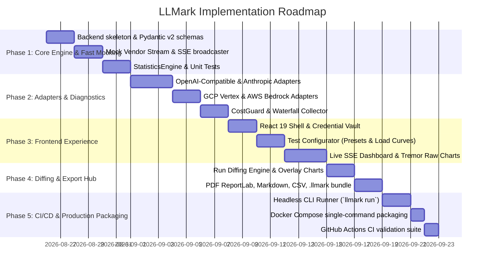

# 🛠️ LLMark — Technical Specification & Implementation Plan

---

## 1. System Overview & Technology Stack

LLMark is architected as a lightweight, local-first monorepo consisting of a **FastAPI backend** (Python 3.12+) and a **React 19 frontend** (Vite + TypeScript).

```
llmark/
├── backend/                  # FastAPI + Python 3.12+ (uv managed)
│   ├── app/
│   │   ├── api/routes/       # REST + SSE endpoints
│   │   ├── core/             # Orchestrator, metrics collector, stats & diff engine
│   │   ├── adapters/         # Vendor adapters (OpenAI, Anthropic, GCP, Bedrock)
│   │   ├── models/           # Pydantic v2 schemas & SQLAlchemy 2.0 ORM models
│   │   └── db/               # SQLite (v1) async session & migrations
│   ├── cli.py                # Headless CI runner (`llmark run`)
│   └── tests/                # pytest unit & integration test suites
│
└── frontend/                 # React 19 + Vite + TypeScript (pnpm / npm)
    ├── src/
    │   ├── app/              # shadcn-admin layout & router
    │   ├── components/       # Credential vault, configurator, live charts, diff viewer
    │   ├── hooks/            # useBenchmarkSSE, useRunDiff, useBenchmarkHistory
    │   └── pages/            # Benchmark, Diff, Results, Report
    └── tailwind.config.ts    # Tailwind CSS v4
```

### Core Technologies
- **Backend:** Python 3.12, FastAPI 0.115+, Pydantic v2.10+, `asyncio.TaskGroup`, `httpx` (async HTTP client with streaming), SQLAlchemy 2.0 (asyncio + `aiosqlite`), `numpy`, `structlog`, `reportlab`, `uv` package manager.
- **Frontend:** React 19, TypeScript 5.6+, Vite 6+, Tailwind CSS v4, shadcn/ui primitives, Tremor Raw (clean SVG charts), TanStack Table v8, TanStack Query v5, Lucide React.
- **Packaging & DevOps:** Docker & Docker Compose (single command `docker compose up`), GitHub Actions CI.

---

## 2. Data Contracts & Pydantic v2 Schemas

All schemas reside in `backend/app/models/schemas.py`.

```python
from enum import Enum
from typing import Any, Dict, List, Optional
from pydantic import BaseModel, Field, HttpUrl

class VendorType(str, Enum):
    OPENAI = "openai"
    ANTHROPIC = "anthropic"
    GCP_VERTEX = "gcp_vertex"
    AWS_BEDROCK = "aws_bedrock"
    OPENAI_COMPATIBLE = "openai_compatible"  # Groq, Together, vLLM, DeepSeek, Ollama

class WorkloadPreset(str, Enum):
    CHAT = "chat"                   # ~200 in / ~150 out
    RAG = "rag"                     # ~3,500 in / ~400 out
    CODE = "code"                   # ~1,200 in / ~800 out
    LONG_CONTEXT = "long_context"   # ~16k-32k in / ~500 out
    VISION = "vision"               # 1080p chart image + prompt
    JSON_SCHEMA = "json_schema"     # Pydantic structured output
    CUSTOM = "custom"               # User-provided prompt or JSONL dataset

class LoadCurveType(str, Enum):
    CONSTANT = "constant"           # Flat concurrency (e.g. 10 workers)
    RAMP_UP = "ramp_up"             # Linear ramp (e.g. 1 -> 50 workers over duration)
    SPIKE = "spike"                 # Low baseline with sudden surges
    POISSON = "poisson"             # Target RPS Poisson arrival rate

class VendorCredential(BaseModel):
    """Ephemeral credentials scrubbed from DB, disk, and persistent logs."""
    api_key: str = Field(..., description="API key or token")
    base_url: Optional[str] = Field(None, description="Custom base URL for vLLM/Ollama/Groq/OpenRouter")
    organization_id: Optional[str] = None
    aws_region: Optional[str] = "us-east-1"
    aws_access_key_id: Optional[str] = None
    aws_secret_access_key: Optional[str] = None
    gcp_project_id: Optional[str] = None
    gcp_location: Optional[str] = "us-central1"

class SLOThresholds(BaseModel):
    max_ttft_ms: float = Field(1500.0, description="Max acceptable TTFT in milliseconds")
    max_tpot_ms: float = Field(50.0, description="Max acceptable Time Per Output Token in ms")
    max_e2e_ms: float = Field(10000.0, description="Max acceptable E2E duration in ms")
    max_error_rate_pct: float = Field(1.0, description="Max acceptable error percentage")

class BenchmarkConfig(BaseModel):
    name: str = Field("Benchmark Run", description="Human-readable run name")
    vendor: VendorType
    model: str = Field(..., example="gpt-4o")
    credential: VendorCredential
    workload_preset: WorkloadPreset = WorkloadPreset.CHAT
    custom_prompt: Optional[str] = None
    custom_messages: Optional[List[Dict[str, Any]]] = None
    json_schema: Optional[Dict[str, Any]] = None
    max_tokens: int = Field(512, ge=1, le=8192)
    temperature: float = Field(0.7, ge=0.0, le=2.0)
    load_curve: LoadCurveType = LoadCurveType.CONSTANT
    concurrency: int = Field(5, ge=1, le=100)
    target_rps: Optional[float] = Field(None, ge=0.1, le=100.0)
    duration_seconds: int = Field(30, ge=5, le=300)
    warmup_requests: int = Field(2, ge=0, le=5)
    cache_bust: bool = Field(False, description="Append unique nonce to defeat prefix caching")
    hard_spend_cap: Optional[float] = Field(2.0, description="Max dollar spend ceiling before circuit break")
    slo: SLOThresholds = Field(default_factory=SLOThresholds)

class TokenEvent(BaseModel):
    token: str
    reasoning: Optional[str] = None
    timestamp: float
    usage: Optional[Dict[str, int]] = None
    is_final: bool = False

class WaterfallTiming(BaseModel):
    dns_ms: float = 0.0
    tcp_ms: float = 0.0
    tls_ms: float = 0.0
    ttft_ms: float = 0.0
    decode_ms: float = 0.0
    total_e2e_ms: float = 0.0

class MetricsSnapshot(BaseModel):
    benchmark_id: str
    status: str = "running"  # running, completed, aborted, budget_exceeded, failed
    elapsed_seconds: float
    total_requests: int
    completed_requests: int
    failed_requests: int
    current_tps: float
    current_rps: float
    current_spend_usd: float
    waterfall_avg: WaterfallTiming
    ttft_p50: float
    ttft_p95: float
    ttft_p99: float
    ttfa_p50: Optional[float] = None
    ttfa_p95: Optional[float] = None
    itl_p50: float
    itl_p95: float
    itl_p99: float
    max_itl: float
    tpot_mean: float
    goodput_pct: float
    error_rate_pct: float
```

---

## 3. SSE Streaming Protocol & Event Specifications

Live telemetry is delivered from `GET /api/benchmark/stream?id={benchmark_id}` using standard Server-Sent Events (SSE).

### Event Format & Payloads

```
event: connection_open
data: {"benchmark_id": "bmk_123", "status": "initializing", "timestamp": 1771984800.123}

event: waterfall_baseline
data: {"dns_ms": 14.2, "tcp_ms": 28.5, "tls_ms": 32.1, "baseline_rtt_ms": 74.8}

event: progress_snapshot
data: {
  "benchmark_id": "bmk_123",
  "status": "running",
  "elapsed_seconds": 12.4,
  "completed_requests": 34,
  "failed_requests": 0,
  "current_tps": 412.5,
  "current_spend_usd": 0.084,
  "ttft_p50": 182.4,
  "ttft_p95": 245.1,
  "ttft_p99": 312.0,
  "itl_p95": 28.4,
  "max_itl": 89.2,
  "goodput_pct": 97.1
}

event: budget_warning
data: {"current_spend_usd": 1.85, "spend_cap_usd": 2.0, "message": "Approaching spend cap (92.5%)"}

event: run_complete
data: {"benchmark_id": "bmk_123", "status": "completed", "final_metrics_summary": {...}}
```

---

## 4. Database Schema (SQLAlchemy 2.0 Async + SQLite)

Database models reside in `backend/app/models/db/`. Ephemeral API keys are **never stored** in any table.

```python
# backend/app/models/db/models.py
from datetime import datetime
from sqlalchemy import String, Float, Integer, DateTime, Boolean, JSON, ForeignKey
from sqlalchemy.orm import DeclarativeBase, Mapped, mapped_column, relationship

class Base(DeclarativeBase):
    pass

class BenchmarkRun(Base):
    __tablename__ = "benchmark_runs"

    id: Mapped[str] = mapped_column(String(36), primary_key=True)
    name: Mapped[str] = mapped_column(String(128), nullable=False)
    vendor: Mapped[str] = mapped_column(String(64), nullable=False)
    model: Mapped[str] = mapped_column(String(128), nullable=False)
    workload_preset: Mapped[str] = mapped_column(String(64), nullable=False)
    load_curve: Mapped[str] = mapped_column(String(64), nullable=False)
    concurrency: Mapped[int] = mapped_column(Integer, nullable=False)
    duration_seconds: Mapped[int] = mapped_column(Integer, nullable=False)
    status: Mapped[str] = mapped_column(String(32), default="pending")  # completed, aborted, failed
    
    # Financial & Count Summaries
    total_requests: Mapped[int] = mapped_column(Integer, default=0)
    completed_requests: Mapped[int] = mapped_column(Integer, default=0)
    failed_requests: Mapped[int] = mapped_column(Integer, default=0)
    total_prompt_tokens: Mapped[int] = mapped_column(Integer, default=0)
    total_gen_tokens: Mapped[int] = mapped_column(Integer, default=0)
    total_cost_usd: Mapped[float] = mapped_column(Float, default=0.0)
    
    # Latency Percentiles (Milliseconds)
    ttft_p50: Mapped[float] = mapped_column(Float, default=0.0)
    ttft_p75: Mapped[float] = mapped_column(Float, default=0.0)
    ttft_p95: Mapped[float] = mapped_column(Float, default=0.0)
    ttft_p99: Mapped[float] = mapped_column(Float, default=0.0)
    
    ttfa_p50: Mapped[Optional[float]] = mapped_column(Float, nullable=True)
    ttfa_p95: Mapped[Optional[float]] = mapped_column(Float, nullable=True)
    
    itl_p50: Mapped[float] = mapped_column(Float, default=0.0)
    itl_p95: Mapped[float] = mapped_column(Float, default=0.0)
    itl_p99: Mapped[float] = mapped_column(Float, default=0.0)
    max_itl: Mapped[float] = mapped_column(Float, default=0.0)
    
    tpot_mean: Mapped[float] = mapped_column(Float, default=0.0)
    tps_decode: Mapped[float] = mapped_column(Float, default=0.0)
    goodput_pct: Mapped[float] = mapped_column(Float, default=0.0)
    
    # Network Waterfall Baseline
    dns_p50: Mapped[float] = mapped_column(Float, default=0.0)
    tcp_p50: Mapped[float] = mapped_column(Float, default=0.0)
    tls_p50: Mapped[float] = mapped_column(Float, default=0.0)
    
    # Raw Microsecond Arrays (Stored as compressed JSON for Run Diffing)
    raw_telemetry: Mapped[Optional[Dict]] = mapped_column(JSON, nullable=True)
    config_snapshot: Mapped[Dict] = mapped_column(JSON, nullable=False)
    
    created_at: Mapped[datetime] = mapped_column(DateTime, default=datetime.utcnow)
    completed_at: Mapped[Optional[datetime]] = mapped_column(DateTime, nullable=True)
```

---

## 5. Core Engine & Backend Modules

### 1. `BenchmarkOrchestrator` (`backend/app/core/orchestrator.py`)
- Manages pre-flight checks, baseline network waterfall measurement, warmup requests, and workload dispatch.
- Uses `asyncio.TaskGroup` to supervise concurrent worker coroutines.
- Integrates a `CancellationToken` checked by all workers prior to dispatching next requests.
- Pushes state snapshots to active SSE listener queues every 100ms.

### 2. `CostGuard` (`backend/app/core/cost_guard.py`)
- Maintains pricing matrices per vendor/model.
- Computes pre-flight token estimate bounds:
  $$\text{Min Tokens} = N_{\text{concurrency}} \times (\text{Prompt Tokens} + 1)$$
  $$\text{Max Tokens} = N_{\text{concurrency}} \times (\text{Prompt Tokens} + \text{Max Tokens}) \times \frac{\text{Duration}}{\text{Avg Request Duration}}$$
- Tracks live dollar spend during the run; triggers circuit breaker abort when `current_spend_usd >= hard_spend_cap`.

### 3. `WaterfallCollector` (`backend/app/core/waterfall_collector.py`)
- Employs `httpx` async transport hooks (`event_hooks={"request": [...], "response": [...]}`) or native socket timers to record microsecond DNS resolution, TCP SYN/ACK handshake, and TLS negotiation before stream generation starts.

### 4. `StatisticsEngine` (`backend/app/core/statistics_engine.py`)
- Collects raw arrays of TTFT, TTFA, and chunk-normalized ITL deltas.
- Computes percentiles via `numpy.percentile(array, [50, 75, 95, 99])`.
- Computes Goodput percentage against user `SLOThresholds`.

### 5. `DiffEngine` (`backend/app/core/diff_engine.py`)
- Compares Run A against Run B across all percentiles and metrics:
  $$\Delta\% = \frac{\text{Metric}_B - \text{Metric}_A}{\text{Metric}_A} \times 100\%$$
- Produces comparison datasets for overlay charts and visual diff matrices.

### 6. `ReportExporter` (`backend/app/core/report_exporter.py`)
- **PDF:** Formats executive summary, latency distribution charts, and Goodput breakdown using ReportLab.
- **Markdown:** Renders copy-ready GitHub Flavored Markdown summary tables.
- **CSV:** Emits per-request latency, token counts, and error status in RFC 4180 CSV.
- **.llmark Bundle:** Packages run metadata, full microsecond arrays, and config into a single compressed JSON archive.

---

## 6. Frontend Architecture & State Management

### Page Routing & Component Hierarchy
```
src/
├── app/
│   ├── App.tsx                     # Router, layout shell, dark mode provider
│   └── routes.tsx                  # Routes: /, /diff, /results, /report/:id
├── components/
│   ├── credential-vault/           # In-memory masked inputs with validation
│   ├── test-configurator/          # Workload presets, load curves, spend cap slider
│   ├── live-dashboard/             # SSE listener, KPI cards, Tremor charts, abort button
│   │   ├── MetricCards.tsx         # TTFT P95, ITL P99, TPS, Goodput %, Spend
│   │   ├── WaterfallBar.tsx        # DNS -> TCP -> TLS -> TTFT breakdown bar
│   │   ├── LiveLatencyChart.tsx    # Real-time token latency stream chart
│   │   └── AbortButton.tsx         # Instant run cancellation trigger
│   ├── diff-viewer/                # Run A vs Run B comparison view
│   │   ├── DiffMatrixTable.tsx     # Percentage delta table
│   │   └── OverlayChart.tsx        # Context degradation overlay
│   └── report-viewer/              # PDF download, Markdown copy, CSV & .llmark export
└── hooks/
    ├── useBenchmarkSSE.ts          # EventSource / fetch stream consumer with reducer
    ├── useRunDiff.ts               # Fetches comparison data for selected pair of runs
    └── useBenchmarkHistory.ts      # TanStack Query pagination for previous runs
```

### React 19 State Flow for Live Benchmark
```
[User clicks Run] ──► POST /api/benchmark/run
                           │
                           ▼
              Receives { benchmark_id }
                           │
                           ▼
          useBenchmarkSSE establishes SSE connection
                           │
        ┌──────────────────┴──────────────────┐
        ▼                                     ▼
[event: progress_snapshot]          [event: budget_warning]
Reduces state into live gauges      Displays spend toast warning
and Tremor time-series buffer                 │
        │                                     ▼
        ▼                             [event: run_complete]
[User clicks Abort]                 Closes SSE & navigates to
──► POST /benchmark/abort           Results / Report view
```

---

## 7. Headless CLI Specification (`cli.py`)

For automated CI/CD pipelines (e.g. GitHub Actions), LLMark includes a standalone CLI runner:

```bash
# Run benchmark from YAML configuration
python -m app.cli --config benchmark_ci.yaml --fail-under-goodput 95.0 --output-md summary.md

# Exit codes:
# 0 -> Benchmark passed all SLO Goodput criteria
# 1 -> SLO Goodput failed (performance regression detected)
# 2 -> Execution error (rate limit, authentication failure, timeout)
```

### Sample `benchmark_ci.yaml`
```yaml
name: "GPT-4o vs Llama-3-70B Canary Test"
vendor: "openai"
model: "gpt-4o"
workload_preset: "rag"
concurrency: 10
duration_seconds: 45
hard_spend_cap: 1.50
slo:
  max_ttft_ms: 1200.0
  max_tpot_ms: 40.0
  max_e2e_ms: 8000.0
  max_error_rate_pct: 0.0
```

---

## 8. Phase-by-Phase Implementation Roadmap



### Milestone Deliverables

- **Phase 1 (Backend Foundation & Mocking):** Fully functioning FastAPI backend that can run mock 60s streaming benchmarks and emit live SSE metrics.
- **Phase 2 (Vendor Adapters & Diagnostics):** Live adapters for OpenAI, Anthropic, Vertex, Bedrock, and local vLLM, paired with the Waterfall profiler and CostGuard.
- **Phase 3 (Frontend Dashboard):** Clean React 19 + Tailwind v4 + Tremor UI with live charts, preset selectors, and instant abort control.
- **Phase 4 (Diffing & Export Hub):** Visual Run A vs Run B diffing matrix and downloadable multi-format reports.
- **Phase 5 (CLI & Docker Packaging):** 1-command startup (`docker compose up`) and headless CI execution for automated regression testing.
